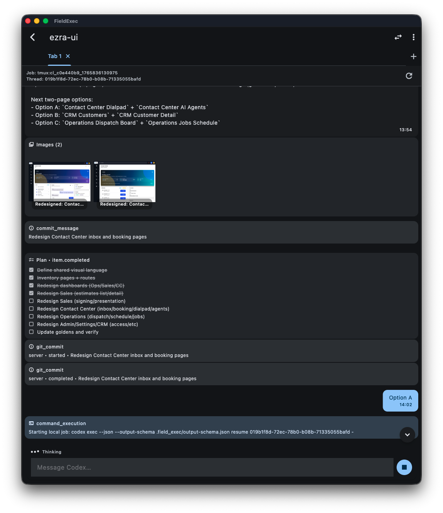

# FieldExec




FieldExec is a Flutter app (iOS + Android + macOS + Linux) that lets you run Codex CLI “sessions” on a machine you control—either **over SSH** (from iOS, Android, macOS, or Linux) or **locally** (macOS/Linux).

It’s designed for concurrency: you can keep multiple projects and multiple sessions running at once, switch between them, and resume past conversations by thread ID.

## Features

- **Remote mode (iOS + Android + macOS + Linux)**: connect to `username@host` over SSH and run `codex exec`.
- **Local mode (macOS + Linux)**: run `codex` directly via local shell execution.
- **Projects**: save remote/local working directories as “projects”.
- **Tabs per project**: multiple concurrent agent sessions per project.
- **Resumable sessions**: `codex exec --json` thread IDs are stored and can be resumed.
- **Structured output**: uses `codex exec --json --output-schema` so the app can render events and interactive action buttons.
- **Background-friendly remote execution**:
  - If `tmux` is available on the remote host, sessions run detached in `tmux`.
  - Otherwise it falls back to `nohup` and tracks the process PID.
- **Stop button**: stops the current remote job (kills tmux session or PID) or local process.
- **Key-based SSH**: store a single global private key in secure storage (Keychain / Android Keystore).
- **Password is never stored**: password is only used as a setup/bootstrapping path to get keys installed.
- **Optional auto-commit**: if the final structured response includes a non-empty `commit_message`, the app runs `git add -A && git commit -m "<commit_message>"` (only if there are changes).

## How It Works

Each user message starts a non-interactive Codex turn:

- Remote: the app starts a background job on the remote host that runs `codex exec --json --output-schema …` in the selected project directory.
- The job appends JSONL output to a project-local log file:
  - `.field_exec/sessions/<tabId>.log`
- The app tails that file over SSH and renders events/messages in the chat UI.

On local mode, the app runs `codex` locally and streams stdout/stderr into the chat in the same JSONL format.

### Remote machine bootstrapping (no install required)

FieldExec **does not need to be installed on the remote machine**. In remote mode it bootstraps per-project state by creating `.field_exec/` files inside the selected project directory (session logs, output schema, and small tracking files). The remote host only needs SSH + Codex CLI (and `tmux` is optional but recommended).

## Requirements

- Flutter SDK (+ Xcode for iOS/macOS builds, Android SDK for Android builds).
- Codex CLI installed on the machine that will run Codex:
  - Local mode: installed on the same machine running the app.
  - Remote mode: installed on the remote host reachable via SSH.
- SSH server enabled on the remote host (macOS: System Settings → Sharing → Remote Login).
- Optional (recommended): `tmux` installed on the remote host for the best “keep running while disconnected” behavior.

## Quick Start

```bash
flutter pub get
rinf gen
flutter devices
flutter run -d <DEVICE_ID> --release
```

## Setup

Install dependencies:

```bash
flutter pub get
```

Generate Dart bindings from Rust signals:

```bash
rinf gen
```

Install the Rinf CLI (required for `rinf gen` and the pre-commit hook):

```bash
cargo install rinf_cli
```

Install git hooks (runs `rinf gen` on commit):

```bash
./scripts/install-git-hooks.sh
```

Run macOS:

```bash
flutter run -d macos
```

Run Linux:

```bash
flutter run -d linux
```

Run iOS (device or simulator):

```bash
flutter run -d ios
```

### Linux setup notes

Flutter’s Linux desktop toolchain is required. On Debian/Ubuntu you typically need:

```bash
sudo apt-get update
sudo apt-get install -y clang cmake ninja-build pkg-config libgtk-3-dev
```

Then enable Linux desktop support (if needed) and verify:

```bash
flutter config --enable-linux-desktop
flutter doctor
```

## UI Catalog (widgetbook)

To iterate on UI without running FieldExec’s services, run the standalone catalog app:

```bash
cd packages/widgetbook
flutter run -d macos
```

### macOS sandbox note

Local execution requires the macOS App Sandbox to be disabled. This repo sets:

- `macos/Runner/DebugProfile.entitlements`
- `macos/Runner/Release.entitlements`

to `com.apple.security.app-sandbox = false`.

## Using the App

### Connect (Remote mode)

1. Enter `username@host` and the port.
2. If a key is saved, the app tries key auth first.
3. If key auth fails (or no key exists), it prompts for a password (not stored).

### Manage SSH keys

Use **Settings → SSH Keys** to:

- Paste/import a PEM private key
- Generate a new Ed25519 key
- Install the derived public key on a server (writes to `~/.ssh/authorized_keys`)

Currently the app supports **one global key**.

### Projects, tabs, and resuming conversations

- Add a project by selecting a path (remote path over SSH, or local path on macOS local mode).
- Each project has tabs; each tab runs an independent Codex session.
- Use the history picker to resume a previous `thread_id`.

## Data & Security

- Private keys are stored using `flutter_secure_storage`.
- Passwords are never stored.
- Session logs are written into the project under `.field_exec/`.
  - The app automatically adds `.field_exec/` to `.git/info/exclude` before auto-commit so logs/schema don’t get committed.
- See `SECURITY.md` for security best practices (including SSH hardening and VPN suggestions like WireGuard).

## Troubleshooting

- **macOS: `flutter run -d macos` fails during codesign with `errSecInternalComponent`**\n\n  This is almost always a local Keychain/codesign permissions issue (Xcode GUI builds can still succeed).\n  Run:\n\n  `scripts/fix-macos-cli-codesign.sh`\n+
- If you don’t see `tmux` sessions on the remote host, install `tmux` or the app will fall back to `nohup`+PID.
- To inspect remote processes: `ps -ax | grep codex`
- The active remote session log is in `.field_exec/sessions/<tabId>.log`

## License

MIT. See `LICENSE.md`.

## Contributing

Contributions and audits are welcome.

- Bugs/UX issues: open an issue with repro steps and logs/screenshots when possible.
- Pull requests: keep changes focused and add/update tests when reasonable.
- Rust ↔ Dart bindings: if you modify Rinf signal structs, run `rinf gen` before committing.
- Security issues: please follow `SECURITY.md` (prefer private reporting).

## Using Rust Inside Flutter

This project leverages Flutter for GUI and Rust for the backend logic,
utilizing the capabilities of the
[Rinf](https://pub.dev/packages/rinf) framework.

To run and build this app, you need to have
[Flutter SDK](https://docs.flutter.dev/get-started/install)
and [Rust toolchain](https://www.rust-lang.org/tools/install)
installed on your system.
You can check that your system is ready with the commands below.
Note that all the Flutter subcomponents should be installed.

```shell
rustc --version
flutter doctor
```

You also need to have the CLI tool for Rinf ready.

```shell
cargo install rinf_cli
```

Signals sent between Dart and Rust are implemented using signal attributes.
If you've modified the signal structs, run the following command
to generate the corresponding Dart classes:

```shell
rinf gen
```

Now you can run and build this app just like any other Flutter projects.

```shell
flutter run
```

For detailed instructions on writing Rust and Flutter together,
please refer to Rinf's [documentation](https://rinf.cunarist.org).

## Disclaimer

Codex is a trademark of OpenAI. This project is not affiliated with, endorsed by, or sponsored by OpenAI.
